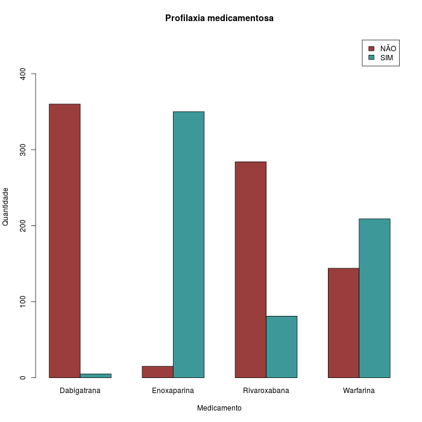

```{r config, echo=FALSE}
knitr::opts_knit$set(root.dir = "..")
library(pander, quietly = T)
library(Gmisc, quietly = T)
```

```{r, echo=FALSE}
source("scripts/resultados.R")
suppressWarnings(Sys.setlocale("LC_NUMERIC", "pt_BR.UTF-8"))
```

```{r tabela1, echo=FALSE, results='asis'}

SPT.pos <- describeFactors(dados$SPT)[2]

IMC.mdp <- describeMean(dados$IMC)[1]

JTQ.prop <- round(sum(sort(table(dados$CAE), decreasing = T)[1:3])/N.final*100, 1)
```

```{r medicamentos, echo = FALSE}
Dabi.pos <- describeFactors(dados$Dabigatrana)[2]
Enoxa.pos <- describeFactors(dados$Enoxaparina)[2]
Rivaro.pos <- describeFactors(dados$Rivaroxabana)[2]
Varfa.pos <- describeFactors(dados$Varfarina)[2]
Nummeds.pos <- describeFactors(dados$Numero.Medicamentos)
```

```{r comorbidades, echo = FALSE}
Artri.pos <- describeFactors(dados$Artrite.Reumatoide)[2]
AVE.pos <- describeFactors(dados$AVE)[2]
Cardio.pos <- describeFactors(dados$Cardiopatia)[2]
DM.pos <- describeFactors(dados$DM)[2]
DR.pos <- describeFactors(dados$Doenca.Reumatica)[2]
HAS.pos <- describeFactors(dados$HAS)[2]
Obes.pos <- describeFactors(dados$Obesidade)[2]
```


# INTRODUÇÃO

# JUSTIFICATIVA

# OBJETIVOS

# METODOLOGIA

## Tipo de estudo

## Coleta de dados

### Variáveis do estudo

Para a análise dos dados foram utilizadas as seguintes variáveis: gênero, faixa etária, as comorbidades, o CAE de entrada, os anticoagulantes prescritos e a presença de SPT.

### Fontes dos dados

Os dados utilizados neste estudo foram obtidos de três fontes complementares, ou calculados *a posteriori* a partir de dados destas três fontes.

#### Sistema (CARDIOLOGIA)

**VERÔNICA, INCLUIR O NOME DO SISTEMA NO TÍTULO ACIMA E ABAIXO**

Primeiramente foi feita uma busca no sistema (SISTEMA CARDIOLOGIA) por pacientes que haviam feito cirurgia no Instituto e tinham diagnóstico positivo no ecodoppler.

Foram obtidos neste sistema o número de prontuário, a data do exame e o(s) tipo(s) de trombo(s) identificado(s).
A classificação do tipo de trombo apresentado pelos pacientes (agudo, subagudo, antigo ou recanalizado) foi obtida a partir do laudo do exame de ecodoppler.

#### Sistema (MV)

**VERÔNICA, INCLUIR O NOME DO SISTEMA NO TÍTULO ACIMA E ABAIXO**

De posse do número de prontuário dos pacientes positivos no ecodoppler, foi feito um levantamento mais detalhado no (SISTEMA MV) para obter os dados antropométricos, gênero, data de nascimento, o CAE de origem e as prescrições dos quatro anticoagulantes estudados.

As informações sobre a presença das comorbidades artrite reumatóide, doenças reumáticas, diabetes mellitus, hipertensão arterial, acidente vascular encefálico e cardiopatias foram obtidas a partir do diagnóstico dado pelo clinico ou foram relatadas pelo paciente ou acompanhante na admissão hospitalar.
A comorbidade obesidade foi estipulada a partir do índice de massa corporal (IMC) do paciente, conforme abaixo.

#### Diagnóstico de especialistas

Para cada paciente, foram obtidas no sistema da cardiologia as imagens do exame de ecodoppler, que foram posteriormente apresentadas a dois especialistas.
O diagnóstico de ocorrência de SPT foi dado por um cirurgião vascular ou por um ecocardiografista do Instituto após avaliação destas imagens.

### Dados faltantes

Após o levantamento inicial dos dados identificou-se que alguns pacientes não tinham informações antropométricas completas no sistema, como altura ou peso.

Na tabela de dados quantitativos é apresentado o número de pacientes disponível para o cálculo de cada variável.

### Prontuários em multiplicidade

Devido à busca inicial de prontuários com ecodoppler positivo, foi identificado que alguns pacientes fizeram mais de um exame e/ou cirgurgia.

Cada paciente foi contabilizado uma única vez.
Pacientes com múltiplos exames, isto é, prontuários que foram levantados mais de uma vez no período analisado no estudo, tiveram suas duplicatas excluídas.
Foi considerada apenas a primeira data de exame.

### Tratamento dos dados

Após o levantamento dos dados brutos, novos dados foram calculados para a análise descritiva da amostra do estudo.

A idade dos pacientes (em anos) foi determinada da data de nascimento, em relação à data de exame.
Para avaliar o impacto da TEV em idosos este dado quantitativo foi convertido em duas faixas etárias com o corte de < 65 anos (não idosos) e >= 65 anos (idosos).

Para determinar a presença de obesidade, primeiramente o índice de massa corporal (IMC) foi calculado para os pacientes em que tanto a altura e o peso estavam disponíveis, através da fórmula IMC = peso (kg)/ altura (m)2.
Para este parâmetro foi adotado o corte de < 30 kg/m2 (normais) e >= 30kg/m2 (obesos), de acordo com os critérios da OMS para classificação da obesidade.

## Análise estatística

Todos os tratamentos e as análises dos dados foram realizados no software estatístico R (versão 3.3.2).

### Análise descritiva

Os dados quantitativos (idade, altura, peso e IMC) foram descritos na forma de tabela com Média, desvio padrão (DP), mediana, amplitude interquartílica (AIQ) bem como os valores mínimo e máximo dos dados.

Os dados qualitativos (gênero, faixa etária, CAE, SPT, anticoagulantes, comorbidades e tipo de trombo) foram descritos como frequência (n) e proporção (%) em tabelas e figuras.

### Associação entre dados categóricos

A fim de avaliar se havia associação dos dados categóricos, foram criadas tabelas de contingência que estratificam os dados por gênero e por faixa etária.
Como em algumas variáveis não havia observações suficientes para algumas categorias, a significância estatística da associação foi avaliada com o Teste Exato de Fisher.

Em todas as análises foi utilizado o nível de significância de 5%.

# RESULTADOS

## Perdas do estudo

Após o levantamento dos pacientes com diagnóstico positivo para TVP (N original `r N.orig`), foram encontrados `r length(Pront.dup)` prontuários com múltiplas ocorrências no período de 5 anos do estudo. Por este motivo foram excluídas `r N.dup` entradas duplicadas, preservando apenas a primeira ocorrência de cada paciente.

## Dados demográficos dos pacientes

No período de 2010 até 2014, foram realizadas 32.367 cirurgias no INTO. Neste mesmo período, foram identificados `r N.final` pacientes que apresentaram diagnóstico positivo para TVP através do exame de ecodoppler. Na tabela xx estão descritos as variáveis demográficas numéricas destes pacientes. A população do estudo foi composta por `r describeFactors(dados$Genero)[2]` homens e `r describeFactors(dados$Genero)[1]` mulheres.  Idade média  (± DP) foi de  `r describeMean(dados$Idade)` anos e a média (± DP) do IMC foi  `r describeMean(dados$IMC)[1]` kg/m2.

`r pander(tab2)`

Table: AIQ = Amplitude Interquartílica (Q3 - Q1); DP: Desvio Padrão; IMC: Índice de Massa Corpórea.

## Ocorrência dos tipos de trombos identificados pelo exame de ecodoppler


`r pander(print(trombos, printToggle = F))`

Table: Ocorrência dos tipos de trombo identificados no ecodoppler

## Distribuição de casos de TVP por CAE

Os `r N.final` pacientes que constituíram a amostra do presente estudo foram estratificados quanto ao Centro de atenção especializada responsável pelo seu tratamento. A figura xx ilustra o número de pacientes com diagnóstico positivo para TVP por CAE. Os principais centros responsáveis pelo tratamento dos pacientes que apresentaram TEV foram: CAE do joelho (`r CAE.tab["JOELHO"]` pacientes); CAE do trauma (`r CAE.tab["TRAUMA"]` pacientes); CAE do quadril (`r CAE.tab["QUADRIL"]` pacientes), CAE da coluna (`r CAE.tab["COLUNA"]` pacientes), CAE do pé (`r CAE.tab["PÉ"]` pacientes) e oncologia ortopédica (`r CAE.tab["ONCO"]` pacientes).


## Incidência de TVP por Centro de Atenção Especializada

## Avaliação dos anticogulantes prescritos para os pacientes com TVP

A análise descritiva dos medicamentos prescritos para os pacientes está apresentada na figura xx.

Todos os pacientes que foram submetidos à cirurgia ortopédica de grande porte (ATQ, ATJ, Coluna e Trauma do Fêmur), receberam profilaxia medicamentosa de acordo com o protocolo do INTO. Os pacientes que foram submetidos a cirurgias ortopédicas dos centros do pé, do ombro, da mão, do tumor, da microcirurgia, da crânio-maxilofacial não é indicada a profilaxia medicamentosa, portanto a mesma não foi administrada. Para os pacientes em que a profilaxia medicamentosa é prescrita, a conduta terapêutica consiste na utilização de um ou mais medicamentos de acordo com o protocolo do Instituto. Para os pacientes com diagnóstico de TVP o protocolo de tratamento adotado pelo Instituto consiste no uso de XXXXXDe uma forma geral, a heparina de baixo peso molecular é prescrita durante a hospitalização, a varfarina e utilizada como na transição para a droga oral e na alta hospitalar o anticoagulante oral rivaroxabana é precrito, de acordo com a avaliação do clínico ou do cirurgião vascular.

Foram avaliadas as quatro drogas disponíveis no instituto, onde identificamos que a heparina de baixo peso molecular foi prescrita para `r Enoxa.pos` pacientes,a varfarina para `r Varfa.pos`, a Rivaroxabana para `r Rivaro.pos` e a Dabigatrana para `r Dabi.pos` pacientes. 



Também foi avaliado o número de medicamentos prescritos para cada pacientes. Dessa forma, identificamos que `r Nummeds.pos[1]` pacientes não receberam nenhuma medicação, `r Nummeds.pos[2]` foram tratados com apenas 1 medicamento, `r Nummeds.pos[3]` foram tratados com 2 tipos de anticoagulantes, `r Nummeds.pos[4]` foram tratados com 3 medicamentos e apenas `r Nummeds.pos[5]` receberam 4 anticoagulantes.

`r pander(print(medicamentos, printToggle = F))`

Table: **Tabela xx** Número de medicamentos prescrito para cada paciente; e número total de pacientes (%) para cada medicamento.

## Avaliação dos casos de síndrome pós-trombótica

## Comorbidades

Com o aumento da expectativa de vida e envelhecimento da população as doenças crônicas vêm se apresentando como importantes fatores de risco para o desenvolvimento de TEV. Neste contexto, ainda há poucos trabalhos na literatura que tenham investigado a fundo a relação entre estas co-morbidades e a ocorrência de TEV no período pós cirúrgico de procedimentos ortopédicos. (REFERENCIAS)
Para a avaliação das comorbidades presentes nos pacientes com TEV foram considerados os `r N.final` pacientes que apresentaram tromboembolismo venoso sintomático e na análise foi observado que alguns pacientes apresentam mais de uma comorbidades diagnosticada pelo clínico ou informada pelo paciente ou acompanhante. A hipertensão arterial foi diagnosticada na internação em `r HAS.pos` pacientes, a obesidade (IMC $\ge$ 30) em `r Obes.pos`, em `r DM.pos` Diabetes Mellitus, em `r Cardio.pos` cardiopatia, em `r Artri.pos` a  artrite reumatoide, em `r AVE.pos` o AVE, e em `r DR.pos` a Doença Reumática, representada na tabela XXX.

`r pander(read.csv2("resultados/comorbidades.csv"))`

Table: **Tabela xx** Número de comorbidades presentes para cada paciente; e número total de pacientes (%) para cada comorbidade.


Para uma maior detalhamento das comorbidades na população de estudo, os pacientes foram estratificados em relação a idade, em idosos $\ge$ 65 anos e não idosos < 65 anos,  e avaliamos a distribuição das diferentes comorbidades em relação aos dois grupos etários. Como resultados, observamos que todas as comorbidades estudadas são igualmente distribuídas nas duas faixas etárias avaliadas. 

![**Figura xx** Estratificação das comorbidades por faixa etária. Os pacientes foram estratificados de acordo com a faixa etária em idosos e não idosos. A ocorrência das diferentes comorbidades foi então avaliada nas duas faixas etárias analisadas. Cada gráfico representa o número de pacientes que apresentam (SIM) ou não (NÃO) cada uma das comorbidades indicadas na população <65 anos (verde) ou >= 65 anos (vermelho). O p-valor corresponde ao teste exato de Fisher para associação dos dados categóricos. AR=Artrite reumatóide; AVE=acidente vascular encefálico; DM=diabetes mellitus; DR=doenças reumatóides; HAS=hipertensão arterial. N=361.](../graficos/comorbidades-idade.png)

A distribuição das comorbidades também foi avaliado após estratificação da população em relação ao gênero. Para esta esta analise, observamos que, das comorbidades estudadas, apenas a AVE é diferencialmente distribuida na população de estudo. Neste caso, observamos que há maior numero de mulheres que apresentam esta comorbidade em relação aos homens. 


## Formação da Comissão de Trombose

(sem resultados estatísticos)

<!-- ## Pacientes com Tromboembolismo Venoso -->

<!-- No período de 2010 até 2014 foram diagnosticados pelo ecodoppler `r N.final` pacientes com TVP.  Destes `r SPT.pos` pacientes desenvolveram síndrome pós- trombótica. A idade média (&plusmn;DP) dos pacientes foi `r describeMean(dados$Idade)[1]` anos.  A média (&plusmn;DP) do IMC foi de `r describeMean(dados$IMC)[1]` e os centros que apresentaram maior percentual de tromboembolismo venoso foram o Centro de Atenção Especializada (CAE) do joelho, do quadril e do trauma (`r JTQ.prop`%). -->

