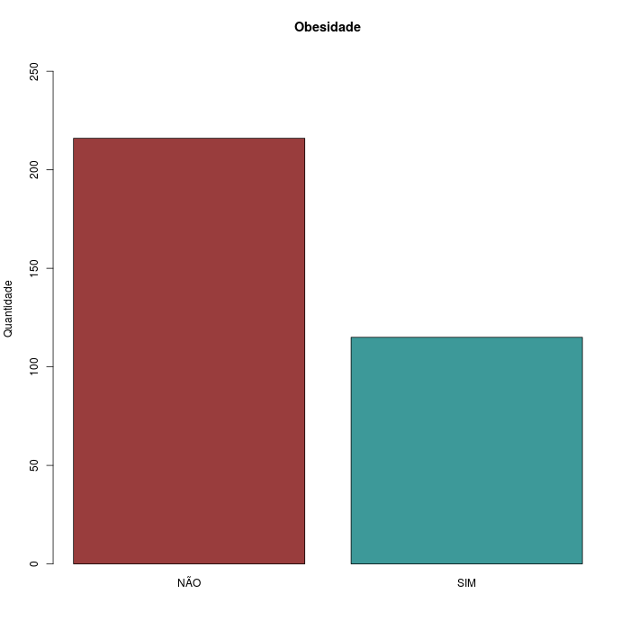
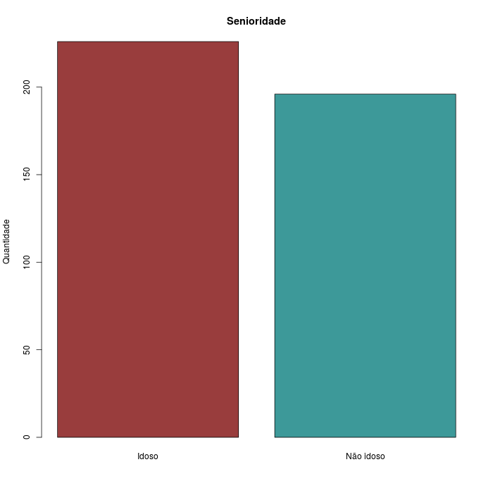

```{r config, echo=FALSE}
knitr::opts_knit$set(root.dir = "..")
library(pander, quietly = T)
library(Gmisc, quietly = T)
```

```{r, echo=FALSE}
source("scripts/resultados.R")
suppressWarnings(Sys.setlocale("LC_NUMERIC", "pt_BR.UTF-8"))
```

```{r tabela1, echo=FALSE, results='asis'}

SPT.pos <- describeFactors(dados$SPT)[2]

IMC.mdp <- describeMean(dados$IMC)[1]

JTQ.prop <- round(sum(sort(table(dados$CAE), decreasing = T)[1:3])/N.final*100, 1)
```

```{r medicamentos, echo = FALSE}
Dabi.pos <- describeFactors(dados$Dabigatrana)[2]
Enoxa.pos <- describeFactors(dados$Enoxaparina)[2]
Rivaro.pos <- describeFactors(dados$Rivaroxabana)[2]
Warfa.pos <- describeFactors(dados$Warfarina)[2]
```

```{r comorbidades, echo = FALSE}
Artri.pos <- describeFactors(dados$Artrite.Reumatoide)[2]
AVC.pos <- describeFactors(dados$AVC)[2]
Cardio.pos <- describeFactors(dados$Cardiopatia)[2]
DM.pos <- describeFactors(dados$DM)[2]
DR.pos <- describeFactors(dados$Doenca.Reumatica)[2]
HAS.pos <- describeFactors(dados$HAS)[2]
```

**MÉTODOS**

A idade dos pacientes (em anos) foi determinada em relação à data de exame. O IMC foi calculado para os pacientes em que tanto a altura e o peso estavam disponíveis.

**Critérios de exclusão**

Foram excluídos da análise os pacientes que não tinham informação completa sobre a profilaxia dos quatro medicamentos estudados, bem como os pacientes que não fizeram uso de pelo menos um dos quatro medicamentos estudados.

Cada paciente foi contabilizado uma única vez. Pacientes em multiplicidade, isto é, prontuários que foram levantados mais de uma vez no período analisado no estudo tiveram suas duplicatas excluídas.

**Dados faltantes**

A descrição dos dados não críticos ao atendimento dos objetivos deste estudo levaram em conta o maior número disponível de pacientes. A média e desvio padrão dos dados numéricos foram calculadas levando em conta apenas os pacientes que continham estes dados. A contagem e porcentagem dos dados categóricos recebeu o mesmo tratamento. Assim, os pacientes que não dispunham de dado foram desconsiderados para o cálculo dos resultados. Em todos os casos em que havia dados faltantes, o número de pacientes não considerados será apresentado.

**5 RESULTADOS**


**Critérios de exclusão**

Após o levantamento dos pacientes com diagnóstico positivo para TVP (N original `r N.orig`), foram encontrados `r length(Pront.dup)` prontuários com múltiplas ocorrências no período de 5 anos do estudo. Por este motivo foram excluídas `r N.dup` entradas duplicadas, preservando apenas a primeira ocorrência de cada paciente.

**dados faltantes**

`r sum(is.na(dados$IMC))` pacientes não tiveram o IMC calculado devido à ausência de dados de altura, peso ou ambos. Não foi encontrada informação sobre a comorbidade Cardiopatia para `r sum(is.na(dados$Cardiopatia))` pacientes.


Após a aplicação dos critérios de inclusão e exclusão foram obtidas informações de `r N.final` pacientes para este estudo.

**5.1.1 Pacientes com Tromboembolismo Venoso**

No período de 2010 até 2014 foram diagnosticados pelo ecodoppler `r N.final` pacientes com TVP.  Destes `r SPT.pos` pacientes desenvolveram síndrome pós- trombótica. A idade média (&plusmn;DP) dos pacientes foi `r describeMean(dados$Idade)[1]` anos.  A média (&plusmn;DP) do IMC foi de `r describeMean(dados$IMC)[1]` e os centros que apresentaram maior percentual de tromboembolismo venoso foram o Centro de Atenção Especializada (CAE) do joelho, do quadril e do trauma (`r JTQ.prop`%).

**5.1.1.1   Medidas Preventivas Medicamentosas e Não Medicamentosas**

Todos os pacientes que foram submetidos à cirurgia  ortopédica de grande porte (ATQ, ATJ, Coluna e Trauma do Fêmur), receberam profilaxia medicamentosa.  A heparina de baixo peso molecular, foi prescrita para `r Enoxa.pos` pacientes, a Rivaroxabana  para `r Rivaro.pos` , a Dabigatrana para `r Dabi.pos` pacientes e a varfarina para `r Warfa.pos`.  Sendo que alguns pacientes no período da hospitalização  foi prescrita HBPM e na alta hospitalar a varfarina ou rivaroxabana de acordo com  avaliação  do clínico ou  do cirurgião vascular. A profilaxia não medicamentosa utilizada é o dispositivo de compressão pneumática: no Centro de Terapia Intensiva (CTI), após o procedimento cirúrgico nos paciente que foram submetidos à artrodese de coluna e para outras cirurgias ortopédicas com prescrição do intensivistas e nas enfermarias após avaliação do clinico.

**5.1.1.1.1   Comorbidades**
 
Nos pacientes que apresentaram tromboembolismo venoso sintomático, `r HAS.pos` dos pacientes apresentaram hipertensão arterial, `r DR.pos` Doença Reumática, em `r Artri.pos` a Artrite Reumatoide, em `r AVC.pos` AVC, em `r DM.pos` Diabetes Mellitus e em `r Cardio.pos` Cardiopatia.

------------------------------------------------

**Novos resultados**

```{r, echo = FALSE}
Obesidade <- dados$IMC>=30
Idoso = dados$Idade >= 65
ob.tab <- table(Obesidade)
sr.tab <- table(Idoso)
```

**Obesidade** (IMC >= 30):

N = 129

`r round(prop.table(table(Obesidade))*100, 1)[2]` %

p-valor: < 0,001
<!-- `r prop.test((table(Obesidade)))$p.value` -->

perdas: 63



**Idosos** (Idade >= 65):

N = 228

`r round(prop.table(table(Idoso))*100, 1)[2]` %

p-valor: `r round(prop.test((table(Idoso)))$p.value, 4)`

(sem perdas)



**Amplitude dos dados quantitativos**

- Idade mínima: `r min(dados$Idade)`
- Idade máxima: `r max(dados$Idade)`
- IMC mínimo: `r round(min(dados$IMC, na.rm = T), 1)`
- IMC máximo: `r round(max(dados$IMC, na.rm = T), 1)`

`r pander(summary(dados[c("Idade", "IMC")]))`
