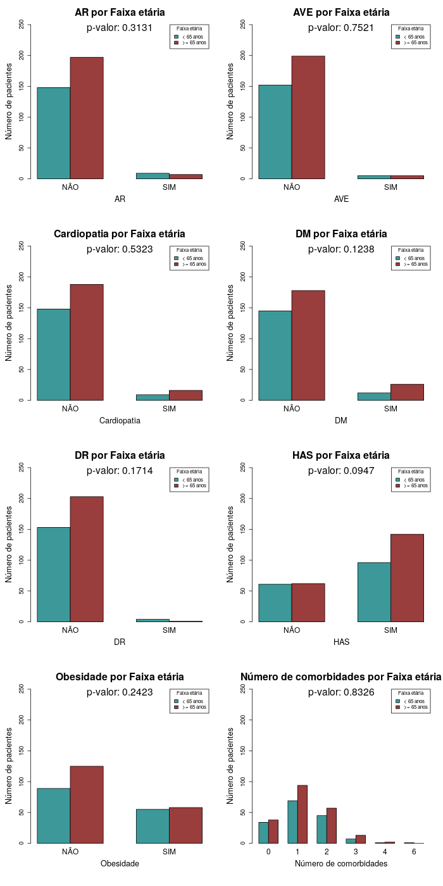
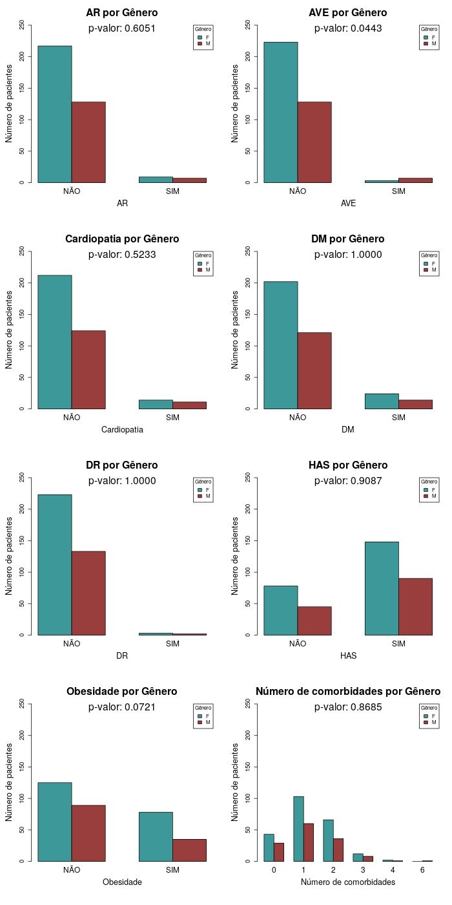

```{r config, echo=FALSE}
knitr::opts_knit$set(root.dir = "..")
library(pander, quietly = T)
library(Gmisc, quietly = T)
```

```{r, echo=FALSE}
source("scripts/resultados.R")
suppressWarnings(Sys.setlocale("LC_NUMERIC", "pt_BR.UTF-8"))
```

```{r tabela1, echo=FALSE, results='asis'}

SPT.pos <- describeFactors(dados$SPT)[2]

IMC.mdp <- describeMean(dados$IMC)[1]

JTQ.prop <- round(sum(sort(table(dados$CAE), decreasing = T)[1:3])/N.final*100, 1)
```

```{r medicamentos, echo = FALSE}
Dabi.pos <- describeFactors(dados$Dabigatrana)[2]
Enoxa.pos <- describeFactors(dados$Enoxaparina)[2]
Rivaro.pos <- describeFactors(dados$Rivaroxabana)[2]
Varfa.pos <- describeFactors(dados$Varfarina)[2]
Nummeds.pos <- describeFactors(dados$Numero.Medicamentos)
```

```{r comorbidades, echo = FALSE}
Artri.pos <- describeFactors(dados$Artrite.Reumatoide)[2]
AVE.pos <- describeFactors(dados$AVE)[2]
Cardio.pos <- describeFactors(dados$Cardiopatia)[2]
DM.pos <- describeFactors(dados$DM)[2]
DR.pos <- describeFactors(dados$Doenca.Reumatica)[2]
HAS.pos <- describeFactors(dados$HAS)[2]
Obes.pos <- describeFactors(dados$Obesidade)[2]
```


# INTRODUÇÃO

# JUSTIFICATIVA

# OBJETIVOS

# METODOLOGIA

A idade dos pacientes (em anos) foi determinada em relação à data de exame. O IMC foi calculado para os pacientes em que tanto a altura e o peso estavam disponíveis.

## Prontuários em multiplicidade

Foram excluídos da análise os pacientes que não tinham informação completa sobre a profilaxia dos quatro medicamentos estudados, bem como os pacientes que não fizeram uso de pelo menos um dos quatro medicamentos estudados.

Cada paciente foi contabilizado uma única vez. Pacientes em multiplicidade, isto é, prontuários que foram levantados mais de uma vez no período analisado no estudo tiveram suas duplicatas excluídas.

## Dados faltantes

A descrição dos dados não críticos ao atendimento dos objetivos deste estudo levaram em conta o maior número disponível de pacientes. A média e desvio padrão dos dados numéricos foram calculadas levando em conta apenas os pacientes que continham estes dados. A contagem e porcentagem dos dados categóricos recebeu o mesmo tratamento. Assim, os pacientes que não dispunham de dado foram desconsiderados para o cálculo dos resultados. Em todos os casos em que havia dados faltantes, o número de pacientes não considerados será apresentado.


# RESULTADOS


## Perdas do estudo

### Prontuários duplicados

Após o levantamento dos pacientes com diagnóstico positivo para TVP (N original `r N.orig`), foram encontrados `r length(Pront.dup)` prontuários com múltiplas ocorrências no período de 5 anos do estudo. Por este motivo foram excluídas `r N.dup` entradas duplicadas, preservando apenas a primeira ocorrência de cada paciente.

### Dados faltantes

`r sum(is.na(dados$IMC))` pacientes não tiveram o IMC calculado devido à ausência de dados de altura, peso ou ambos. Não foi encontrada informação sobre a comorbidade Cardiopatia para `r sum(is.na(dados$Cardiopatia))` pacientes.

**Remover**

Após a aplicação dos critérios de inclusão e exclusão foram obtidas informações de `r N.final` pacientes para este estudo.

## Dados demográficos dos pacientes

No período de 2010 até 2014, foram realizadas 32.367 cirurgias no INTO. Neste mesmo período, foram identificados `r N.final` pacientes que apresentaram diagnóstico positivo para TVP através do exame de ecodoppler. Na tabela xx estão descritos as variáveis demográficas numéricas destes pacientes. A população do estudo foi composta por `r describeFactors(dados$Genero)[2]` homens e `r describeFactors(dados$Genero)[1]` mulheres.  Idade média  (± DP) foi de  `r describeMean(dados$Idade)` anos e a média (± DP) do IMC foi  `r describeMean(dados$IMC)` kg/m2.

`r pander(tab2)`

Table: AIQ = Amplitude Interquartílica (Q3 - Q1); DP: Desvio Padrão; IMC: Índice de Massa Corpórea.


## Distribuição de casos de TEV por CAE

Os `r N.final` pacientes que constituíram a amostra do presente estudo foram estratificados quanto ao Centro de atenção especializada responsável pelo seu tratamento. A figura xx ilustra o número de pacientes com diagnóstico positivo para TVP por CAE. Os principais centros responsáveis pelo tratamento dos pacientes que apresentaram TEV foram: CAE do joelho (`r CAE.tab["JOELHO"]` pacientes); CAE do trauma (`r CAE.tab["TRAUMA"]` pacientes); CAE do quadril (`r CAE.tab["QUADRIL"]` pacientes), CAE da coluna (`r CAE.tab["COLUNA"]` pacientes), CAE do pé (`r CAE.tab["PÉ"]` pacientes) e oncologia ortopédica (`r CAE.tab["ONCO"]` pacientes).


## Incidência de TEV

## Ocorrência de TEP

** Remover esta seção**

## Avaliação dos anticogulantes prescritos para os pacientes com TEV

A análise descritiva dos medicamentos prescritos para os pacientes está apresentada no gráfico xx
Todos os pacientes que foram submetidos à cirurgia ortopédica de grande porte (ATQ, ATJ, Coluna e Trauma do Fêmur), receberam profilaxia medicamentosa de acordo com o protocolo do INTO. Os pacientes que foram submetidos a cirurgias ortopédicas dos centros do pé, do ombro, da mão, do tumor, da microcirurgia, da crânio-maxilofacial não é indicada a profilaxia medicamentosa, portanto a mesma não foi administrada. Para os pacientes em que a profilaxia medicamentosa é prescrita, a conduta terapêutica consiste na utilização de um ou mais medicamentos de acordo com o protocolo do Instituto. Para os pacientes com diagnóstico de TVP o protocolo de tratamento adotado pelo Instituto consiste no uso de XXXXXDe uma forma geral, a heparina de baixo peso molecular é prescrita durante a hospitalização, a varfarina e utilizada como na transição para a droga oral e na alta hospitalar o anticoagulante oral rivaroxabana é precrito, de acordo com a avaliação do clínico ou do cirurgião vascular.
Foram avaliadas as quatro drogas disponíveis no instituto, onde identificamos que a heparina de baixo peso molecular foi prescrita para `r Enoxa.pos` pacientes,a varfarina para `r Varfa.pos`, a Rivaroxabana para `r Rivaro.pos` e a Dabigatrana para `r Dabi.pos` pacientes. 

Também foi avaliado o número de medicamentos prescritos para cada pacientes. Dessa forma, identificamos que `r Nummeds.pos[1]` pacientes não receberam nenhuma medicação, `r Nummeds.pos[2]` foram tratados com apenas 1 medicamento, `r Nummeds.pos[3]` foram tratados com 2 tipos de anticoagulantes, `r Nummeds.pos[4]` foram tratados com 3 medicamentos e apenas `r Nummeds.pos[5]` receberam 4 anticoagulantes.

`r pander(print(medicamentos, printToggle = F))`

Table: **Tabela xx** Número de medicamentos prescrito para cada paciente; e número total de pacientes (%) para cada medicamento.

## Avaliação dos casos de síndrome pós-trombótica

## Comorbidades

Com o aumento da expectativa de vida e envelhecimento da população as doenças crônicas vêm se apresentando como importantes fatores de risco para o desenvolvimento de TEV. Neste contexto, ainda há poucos trabalhos na literatura que tenham investigado a fundo a relação entre estas co-morbidades e a ocorrência de TEV no período pós cirúrgico de procedimentos ortopédicos. (REFERENCIAS)
Para a avaliação das comorbidades presentes nos pacientes com TEV foram considerados os `r N.final` pacientes que apresentaram tromboembolismo venoso sintomático e na análise foi observado que alguns pacientes apresentam mais de uma comorbidades diagnosticada pelo clínico ou informada pelo paciente ou acompanhante. A hipertensão arterial foi diagnosticada na internação em `r HAS.pos` pacientes, a obesidade (IMC ≥ 30) em `r Obes.pos`, em `r DM.pos` Diabetes Mellitus, em `r Cardio.pos` cardiopatia, em `r Artri.pos` a  artrite reumatoide, em `r AVE.pos` o AVE, e em `r DR.pos` a Doença Reumática, representada na tabela XXX.

`r pander(read.csv2("resultados/comorbidades.csv"))`

Table: **Tabela xx** Número de comorbidades presentes para cada paciente; e número total de pacientes (%) para cada comorbidade.

Para uma maior detalhamento das comorbidades na população de estudo, os pacientes foram estratificados em relação a idade, em idosos ≥ 65 anos e não idosos < 65 anos,  e avaliamos a distribuição das diferentes comorbidades em relação aos dois grupos etários. Como resultados, observamos que todas as comorbidades estudadas são igualmente distribuídas nas duas faixas etárias avaliadas. 



A distribuição das comorbidades também foi avaliado após estratificação da população em relação ao gênero. Para esta esta analise, observamos que, das comorbidades estudadas, apenas a AVE é diferencialmente distribuida na população de estudo. Neste caso, observamos que há maior numero de mulheres que apresentam esta comorbidade em relação aos homens. 




<!-- ## Pacientes com Tromboembolismo Venoso -->

<!-- No período de 2010 até 2014 foram diagnosticados pelo ecodoppler `r N.final` pacientes com TVP.  Destes `r SPT.pos` pacientes desenvolveram síndrome pós- trombótica. A idade média (&plusmn;DP) dos pacientes foi `r describeMean(dados$Idade)[1]` anos.  A média (&plusmn;DP) do IMC foi de `r describeMean(dados$IMC)[1]` e os centros que apresentaram maior percentual de tromboembolismo venoso foram o Centro de Atenção Especializada (CAE) do joelho, do quadril e do trauma (`r JTQ.prop`%). -->

